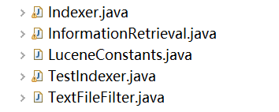
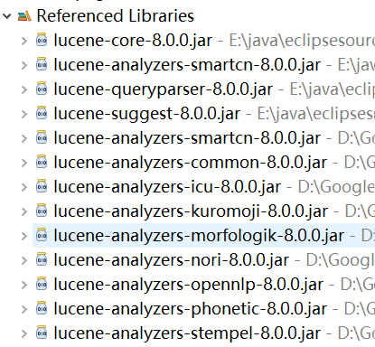
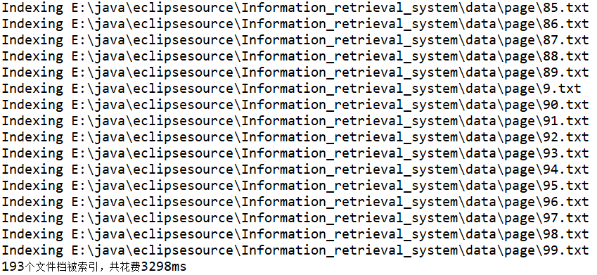
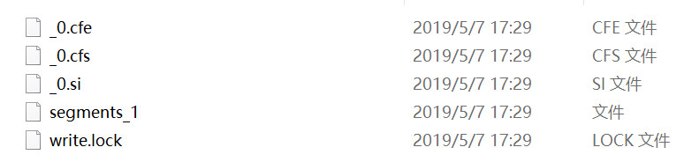
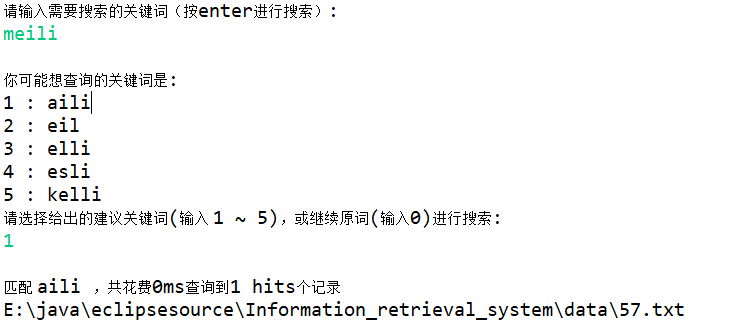

# 信息检索系统

**学号：** 16340179

**姓名：** 彭流生

---

**题目：** 基于课程学习内容，实现简单的搜索引擎功能（界面可视化不做要求，可终端输
出），要求实现以下基本功能：

1. 拼写检查（参考最小编辑距离原理）
2. 倒排索引
3. 使用TF/IDF或者VSM进行文档排序

## 实现

开发工具：Eclipse

API：Lucene-8.0.0

### 一、文件架构

1. java文件

   

   * Indexer.java：建立索引
   * InformationRetrieval.java：信息检索
   * LuceneConstants.java：定义全局变量保存文件路径等
   * TestIndexer.java：生成索引
   * TextFileFilter.java：过滤出目标文件，此处过滤出 .txt文件

2. 引用的Lucene的包

   

   

### 二、构建倒排索引

1. 使用IndexWriter类来构建索引

2. 根据建立的索引的目录以及数据的目录读取

3. 定义FieldType，设置其属性，用于保存文件和索引信息

4. 读取file内容，转换成string

5. 通过文件内容（文件名、文件路径）建立倒排索引

   **代码实现：**

   ``` java
   import java.io.BufferedReader;
   import java.io.File;
   import java.io.FileFilter;
   import java.io.FileReader;
   import java.io.IOException;
   import java.nio.file.FileSystems;
   
   import org.apache.lucene.analysis.Analyzer;
   import org.apache.lucene.analysis.cn.smart.SmartChineseAnalyzer;
   import org.apache.lucene.analysis.standard.StandardAnalyzer;
   import org.apache.lucene.document.Document;
   import org.apache.lucene.document.Field;
   import org.apache.lucene.document.FieldType;
   import org.apache.lucene.index.CorruptIndexException;
   import org.apache.lucene.index.IndexOptions;
   import org.apache.lucene.index.IndexWriter;
   import org.apache.lucene.index.IndexWriterConfig;
   import org.apache.lucene.index.IndexableFieldType;
   import org.apache.lucene.store.Directory;
   import org.apache.lucene.store.FSDirectory;
   import org.apache.lucene.util.Version;
   
   public class Indexer {
   	private IndexWriter writer;
   	public Indexer(String indexDirectoryPath) throws IOException{
   		// 获取目录directory
   		Directory indexDirectory = FSDirectory.open(FileSystems.getDefault().getPath(indexDirectoryPath));
   
   		// 中文分析器
   		Analyzer analyzer = new SmartChineseAnalyzer();
   		IndexWriterConfig config = new IndexWriterConfig(analyzer);
   		writer = new IndexWriter(indexDirectory, config);
   	}
   
   	public void close() throws CorruptIndexException, IOException{
   		writer.close();
   	}
   
   	private Document getDocument(File file) throws IOException{
   		Document document = new Document();
         
   		// 定义一个fieldType，并设置其属性，既保存在文件又用于索引建立
   		FieldType fieldType = new FieldType();
   		fieldType.setStored(true);
   		fieldType.setIndexOptions(IndexOptions.DOCS_AND_FREQS_AND_POSITIONS);
         
   		// 读取 file 转 string
   		StringBuffer buffer = new StringBuffer();
   		BufferedReader bf= new BufferedReader(new FileReader(file));
   		String s = null;
   		while((s = bf.readLine())!=null){//使用readLine方法，一次读一行
   			buffer.append(s.trim());
   		}
   
   		String xml = buffer.toString();
   		// 用文件内容来建立倒排索引
   		Field contentField = new Field(LuceneConstants.CONTENTS, xml,fieldType);
   		// 用文件名来建立倒排索引
   		Field fileNameField = new Field(LuceneConstants.FILE_NAME,file.getName(),fieldType);
   		// 用文件路径来建立倒排索引
   		Field filePathField = new Field(LuceneConstants.FILE_PATH,file.getCanonicalPath(),fieldType);
   	  
   		// 添加到document
   		document.add(contentField);
   		document.add(fileNameField);
   		document.add(filePathField);
   
   		return document;
   	}   
   
   	private void indexFile(File file) throws IOException{
   		System.out.println("Indexing "+file.getCanonicalPath());
   		Document document = getDocument(file);
   		writer.addDocument(document);
   	}
      
       
   	public int createIndex(String dataDirPath, FileFilter filter) 
   			throws IOException{
   		//get all files in the data directory
   		File[] files = new File(dataDirPath).listFiles();
         
   		int count = 0;
   		for (File file : files) {
   			// System.out.println(file);
   			if(!file.isDirectory()
   					&& !file.isHidden()
   					&& file.exists()
   					&& file.canRead()
   					&& filter.accept(file)
   			){
   				indexFile(file);
   				count++;
   			}
   		}
   		return count;
   	}
   }
   ```

   6. 生成索引

      ``` java
      import java.io.IOException;
      import org.apache.lucene.index.IndexReader;
      import java.io.File;
      
      
      public class TestIndexer {
      	String dataDir = "E:/java/eclipsesource/Information_retrieval_system/data/page";
      	String indexDir = "E:/java/eclipsesource/Information_retrieval_system/index";
      	Indexer indexer;
      	
      	// create index
      	private void createIndex() throws IOException {
      		indexer = new Indexer(indexDir);
      		int num_of_index = 0;
      		long startTime = System.currentTimeMillis();
      		num_of_index = indexer.createIndex(dataDir, 
      										   new TextFileFilter());
      		long endTime = System.currentTimeMillis();
      		indexer.close();
      		System.out.println(num_of_index + "个文件档被索引，共花费" 
      		+ (endTime - startTime) + "ms");
      	}
      	
      	public static void main(String[] args) {
      		TestIndexer tester;
      		try {
      			tester = new TestIndexer();
      			tester.createIndex();
      		} catch (IOException e) {
      			// TODO: handle exception
      			e.printStackTrace();
      		}
      	}
      }
      ```

   输出结果：

   

   

   生成的索引文件：

   

### 三、文档排序、关键词搜索

使用TF/IDF或者进行文档排序，并根据关键词对文档进行搜索

	* 读取索引文件
	* 设置为TF/IDF排序
	* 实例化分析器
	* 建立查询解析器
	* 根据输入关键词进行查找

**代码实现：**

``` java
// 搜索
public static void search(String indexDir,String q)throws Exception{

    //得到读取索引文件的路径
    Directory dir = FSDirectory.open(Paths.get(indexDir));

    //通过dir得到的路径下的所有的文件
    IndexReader reader = DirectoryReader.open(dir);

    //建立索引查询器
    IndexSearcher is = new IndexSearcher(reader);

    // 设置为TF/IDF 排序
    ClassicSimilarity sim = new ClassicSimilarity();

    is.setSimilarity(sim);
    //实例化分析器
    Analyzer analyzer = new SmartChineseAnalyzer(); 

    //建立查询解析器
    /**
		 * 第一个参数是要查询的字段；
		 * 第二个参数是分析器Analyzer
		 * */
    QueryParser parser=new QueryParser("contents", analyzer);

    //根据传进来的q查找
    Query query=parser.parse(q);

    //计算索引开始时间
    long start=System.currentTimeMillis();

    //开始查询
    /**
		 * 第一个参数是通过传过来的参数来查找得到的query；
		 * 第二个参数是要出查询的行数
		 * */
    TopDocs hits=is.search(query, 10);

    //计算索引结束时间
    long end=System.currentTimeMillis();

    System.out.println("匹配 " + q + " ，共花费" + (end-start) + "ms"
                       + "查询到" + hits.totalHits + "个记录");

    //遍历hits.scoreDocs，得到scoreDoc
    /**
		 * ScoreDoc:得分文档,即得到文档
		 * scoreDocs:代表的是topDocs这个文档数组
		 * @throws Exception 
		 * */
    for(ScoreDoc scoreDoc:hits.scoreDocs){
        Document doc=is.doc(scoreDoc.doc);
        System.out.println(doc.get(LuceneConstants.FILE_PATH));
    }

    //关闭reader
    reader.close();
}
```

### 四、拼写检查

* 建立目录
* 创建初始化索引
* 根据创建好的索引得出k个建议的关键词
* 根据选择返回关键词

**代码实现：**

``` java
// 拼写检查
public static String[] checkWord(String queryWord){
    //新索引目录
    String spellIndexPath = "E:/java/eclipsesource/Information_retrieval_system/spellIndex";
    //已有索引目录
    String oriIndexPath = "E:/java/eclipsesource/Information_retrieval_system/index";

    //拼写检查
    try {
        //目录
        Directory directory = FSDirectory.open((new File(spellIndexPath)).toPath());

        SpellChecker spellChecker = new SpellChecker(directory);

        //以下几步用来初始化索引
        IndexReader reader = DirectoryReader.open(FSDirectory.open((new File(oriIndexPath)).toPath()));
        //利用已有索引
        Dictionary dictionary = new LuceneDictionary(reader, LuceneConstants.CONTENTS);

        IndexWriterConfig config = new IndexWriterConfig(new SmartChineseAnalyzer());
        spellChecker.indexDictionary(dictionary, config, true);

        int numSug = 5;
        String[] suggestions = spellChecker.suggestSimilar(queryWord, numSug);

        reader.close();
        spellChecker.close();
        directory.close();
        return suggestions;
    } catch (IOException e) {
        // TODO Auto-generated catch block
        e.printStackTrace();
    }
    return null;
}
```

---

## 检索测试

``` java
public static void main(String[] args) throws IOException {
    String indexDir = "E:/java/eclipsesource/Information_retrieval_system/index";
    BufferedReader br = new BufferedReader(new InputStreamReader(System.in)); 
    String str = null; 
    System.out.println("请输入需要搜索的关键词（按enter进行搜索）:"); 
    try {
        str = br.readLine();
        System.out.println(); 
    } catch (IOException e1) {
        // TODO Auto-generated catch block
        e1.printStackTrace();
    }

    // 拼写检查
    String temp = str;
    String[] suggestions = checkWord(str);
    if (suggestions != null && suggestions.length != 0){
        System.out.println("你可能想查询的关键词是:"); 
        for(int i = 0; i < suggestions.length; i++){
            System.out.println((i+1) + " : " + suggestions[i]); 
        }

        System.out.println("请选择给出的建议关键词(输入 1 ~ 5)，或继续原词(输入0)进行搜索:"); 
        str = br.readLine();
        System.out.println(); 
        if (str != "0"){
            str = suggestions[str.charAt(0) - '1'];
        }
        else{
            str = temp;
        }
    }

    try {
        search(indexDir,str);
    } catch (Exception e) {
        // TODO Auto-generated catch block
        e.printStackTrace();
    }
}
```

测试结果（包括拼写检查）：

